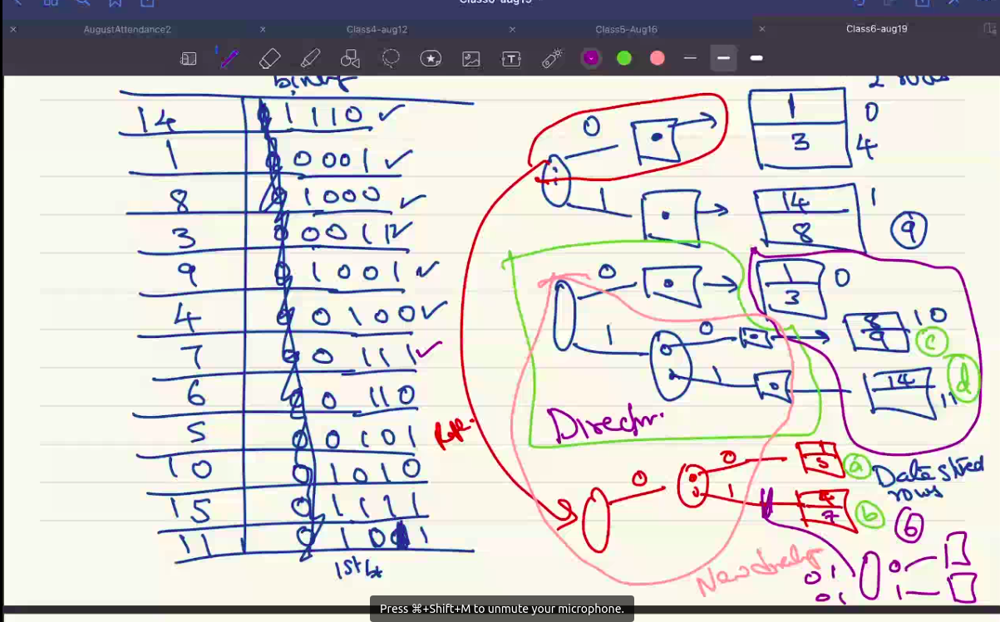

# Summary

1. **Data Block**: Unit of storage
2. **Cost**: OS / Function call to get block.

|                   |   |                             |    |                 |
|-------------------|---|-----------------------------|----|-----------------|
|Size of Data Block | = |Size of block (access unit)  | => | 1 block         |
|                   | > |                             | => | > 1 block access|
|                   | < |                             | => | > 1 data block  | 

3. Data block:
  - Rows: fixed / variable length
  - Unspanned / Spanned
4. File is a set of data blocks
5. Relation $R$ can be stored in multiple files.

- $R$ -> file -> unordered
  $\sigma_{K=v} (R) \thickapprox b/2$ on average
- file -> ordered on $K$
  $\sigma_{K=v} (R) \thickapprox \lceil log_2 (b) \rceil$ on average

Note that $R$ can be sorted only on one subset of attributes.
*Ordering* will help limited set of queries.

---

# Hashing

- Here the hash file is on stable storage
- **Bucket**: Can be 1 data block or $\ge$ 1 data block

## Static Hashing (Number of buckets fixed)

Each bucket can handle $k$ rows without collision.

How to address the problem if $l + 1$ rows are inserted (bucket can't handle this)?

Either reallocate memory (for all buckets) or created a new bucket. This problem will be addressed later.

## Too many collisions

Possible solutions
- Chaining of buckets 
  - Shared overflow blocks (with pointers)
- Use another hash function on top of the previous hash function

$\sigma_{k = val} (R) = 1$ 98% of times (2% of times goes to overflow blocks). 1 when our hash function is good. $O(1 + \epsilon)$

## Hashing Example (Dynamic Hashing)

Storing using starting with 0 or 1.

**Structure**: Directory -> Data stored rows

### File & Data Blocks

The directory structure will be stored as blocks in a file itself.

Access process:

a. access the lookup table for the file f storing the relation.
b. another lookup table to get directories for the file (f1, f2, etc.). These would be logical pointers (the directories have logical pointers to the blocks stored in storage).
c. Now we access another lookup table to get the corresponding physical pointers for given logical pointers.
d. We run the query now to get the corresponding rows' pointers satisfying the query.
e. We get the corresponding blocks. If it's already in main memory then fine. Else bring it from storage.
f. We get the corresponding rows from the blocks.
