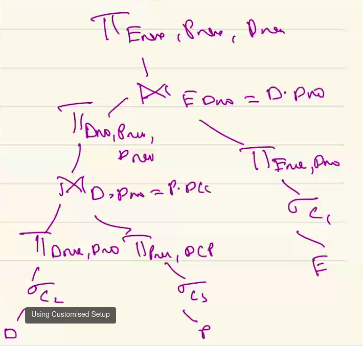

## Equi-Join

$\Pi_L (R \Join S)$

Here LHS = RHS attribute (for the equijoin)

This is same as $\Pi_L (\Pi_M (R) \Join \Pi_N (S))$ where $M$ and $N$ are join attributes. But $L$ is not observed here.

Another way to do,

$L = P \cup Q$, $P$ in $R$ and $Q$ is $S$.

$$= \Pi_{M\cup P} (R) \Join \Pi_{N \cup Q} (S)$$


Just access the attributes that are needed (and join attributes of course).


## Union and Intersection

$$\Pi_L (R \cup S) = \Pi_L (R) \cup \Pi_L (S)$$
$$\Pi_L (R \cap S) = \Pi_L (R) \cap \Pi_L (S)$$

Works for both sets and bags.

$$A \cap (B \cup S) = (A \cap B) \cup (A \cap S)$$

But this doesn't hold for bags.

Union of bags,
$\{red\} \cup \{red\} = \{red, red\}$

## Distinct

$\delta$ := distinct in select

$\delta(R)$ := $R$ if $R$ has no duplicate rows

$$
\delta(R \times / \Join / \Join_c S) = \delta (R) \times / \Join \delta(S)
$$ 

$\delta(\sigma_c (R)) = \sigma_c (\delta(R))$


### How to compute $\delta(\Pi_L (R))$ efficiently?

Scan over clustering or secondary index if $L$ has one attribute. If there's more than one attribute, still we can create an index over multiple attributes. If $>=3$ indexing might become difficult, so we can hash the attributes and use that to find distinct values.

---

```
E(Eno, Ename, Salary, Dno)
D(Dno, Dname, Loc, MEno) 
  MEno: manager of the department
P(Pno, Pname, Loc, DCP)
```

Query

```sql
SELECT Ename, Dname, Pname
From E, D, P
Where Salary > 50000 AND D.Loc = Hyd AND DCP = 5 
AND E.Dno = D.Dno AND D.Dno = P.DCP
```

Call the conditions as $c_1, c_2, \ldots c_n$.

As relational algebra,

$$
\Pi_{Ename, Dname, Pname} \ \sigma_{c_1 \cap c_2 \cap \ldots c_5} \ (E \times D \times P)
$$

We apply the conditions before doing cartesian product. Similarly, we can convert the cartesian product to Join over the respective attributes (given as conditions in where clause).

So, this is equivalent to,

$$
\Pi_{Ename, Dname, Pname} (\sigma_{c_1} (E) \Join_{c_4} \sigma_{c_2} (D) \Join_{c_5} \sigma_{c_3} (P))
$$

Now, we bring the project inside too. So, the query will become equivalent to the following

$$
\Pi_{Ename, Dname, Pname} \{\Pi_{Ename, Dno} \sigma_{c_1} (E) \Join_{c_4} \Pi_{Pname, Dno, Dname} [\Pi_{Dname, Dno} \sigma_{c_2} (D) \Join_{c_5} \Pi_{Pname, DCP} \sigma_{c_3} (P))]\}
$$

This is quite tedious tho. But this is the bare minimum we have to do to the query. Let's see a much nicer way of doing this.

---

```sql
SELECT Ename, Dname, Pname
From E, D, P
Where Salary > 50000 AND D.Loc = Hyd AND DCP = 5 
AND E.Dno = D.Dno AND D.Dno = P.DCP
```

This is written in Canonical Form. Making the canoncial tree (for this query).

```
      PI
      |
      Sigma
      |
      X
     / \ 
    X   P
   / \
  E   D
```

Send the selection as down as possible to the appropriate relations. Make join where possible etc.

```

    PI
    |
    Join (D.Dno = P.DCP)
   /                    \
  Join (E.Dno = D.Dno)   Select(c3)
  /            \          \ 
select(c1)   select(c2)   P
/                 \
E                  D
```

We can further send the projections down (into the tree) like before.



Identifying which Join to perform first is almost arbitrary. Because the distribution of values keep changing (as we select and project over attributes, etc.)

### Uncorrelated queries

```sql
SELECT Ename FROM E
WHERE Dno IN (SELECT Dno FROM D WHERE Dname="Research");
```

These are uncorrelated queries. But we merge these two to perform them better. So, there's a notion of merging the nested queries appropriately.
In case of uncorrelated queries, we only need to execute the 2nd query once. Functionally, we can make two calls (one for the 2nd query and the 1st query). All, we can call them in one call. If there's two calls then we can store the query results in a temporary relation (sort of).

### Correlated queries

```sql
SELECT Ename 
FROM E
WHERE E.Salary >= (
  SELECT AVG(Salary)
  FROM D, P
  WHERE E.Dno = D.Dno AND 
        D.Dno = P.DCP AND 
        P.Loc = Hyd);
```


